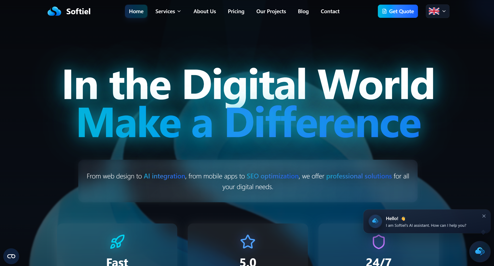
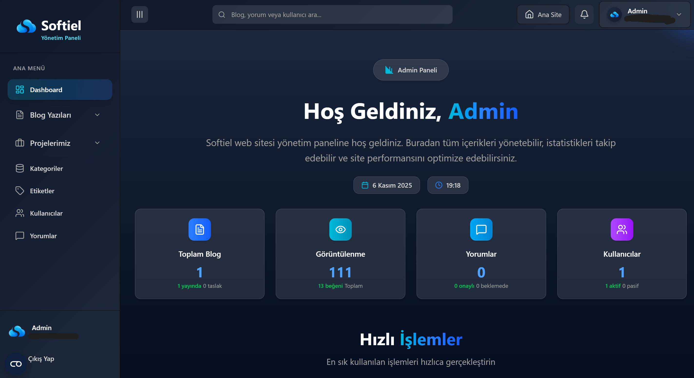

# Softiel Website & CMS Platform

Modern, 6 dil desteğiyle Next.js 14 tabanlı kurumsal web sitesi ve içerik yönetim sistemi.


## 🌐 Website



**Öne Çıkan Özellikler:**
- 6 dil desteği (TR, EN, DE, FR, RU, AR)
- 10 hizmet sayfası (Web Tasarım, SEO, Google Ads, AI Entegrasyonları vb.)
- Blog sistemi (Kategoriler, etiketler, yorumlar)
- Proje portföyü
- İletişim & teklif formları (EmailJS + reCAPTCHA v3)
- Dark mode
- Responsive tasarım
- SEO optimizasyonu

## 🎛️ Dashboard & CMS



**Yönetim Özellikleri:**
- Blog ve proje yönetimi
- Kategori & etiket yönetimi
- Yorum moderasyonu
- Medya kütüphanesi
- Kullanıcı yönetimi
- SEO ayarları
- İstatistikler ve raporlar
- OTP ile iki faktörlü kimlik doğrulama

## 🛠️ Teknoloji Stack

**Frontend:** Next.js 14 (App Router), TypeScript, Tailwind CSS 4, Framer Motion  
**Backend:** Firebase (Firestore, Auth, Storage), Next.js API Routes  
**Güvenlik:** reCAPTCHA v3, OTP, Rate Limiting, Zod Validation  
**Email:** EmailJS, Hostinger SMTP  
**AI:** Google Gemini, Google Translate API

## 🚀 Kurulum

### Gereksinimler
- Node.js 18+ veya 20+
- Firebase hesabı
- EmailJS hesabı (opsiyonel)
- Google reCAPTCHA v3 keys

### Adımlar

```bash
# 1. Repository'yi klonlayın
git clone https://github.com/your-username/your-repo-name.git
cd your-repo-name

# 2. Bağımlılıkları yükleyin
npm install

# 3. .env.local dosyasını oluşturun
cp env.local.template .env.local

# 4. .env.local dosyasını düzenleyin (Firebase, EmailJS, SMTP, reCAPTCHA)

# 5. Geliştirme sunucusunu başlatın
npm run dev
```

**Önemli Environment Variables:**
- `NEXT_PUBLIC_FIREBASE_*` (API Key, Auth Domain, vb.)
- `NEXT_PUBLIC_EMAILJS_*` (Service ID, Template ID, Public Key)
- `NEXT_PUBLIC_RECAPTCHA_SITE_KEY` / `RECAPTCHA_SECRET_KEY`
- `SMTP_*` (Host, Port, User, Pass)

Detaylı kurulum için `env.local.template` dosyasına bakın.

## 📁 Proje Yapısı

```
softiel-website/
├── public/
│   ├── images/              # Görseller
│   └── locales/             # Çeviri dosyaları (tr, en, de, fr, ru, ar)
├── src/
│   ├── app/
│   │   ├── [lang]/          # Dil bazlı routing
│   │   ├── admin-panel-secure-access-2024/    # Admin giriş
│   │   ├── content-management-system-2024/    # CMS Dashboard
│   │   └── api/             # API Routes
│   ├── components/          # React bileşenleri
│   ├── lib/                 # Utility fonksiyonlar
│   ├── contexts/            # React Context'ler
│   └── hooks/               # Custom hooks
```

## 📖 Kullanım

### Web Sitesi
- **Ana Sayfa:** `/[lang]/`
- **Hizmetler:** `/[lang]/services/[service-slug]`
- **Projeler:** `/[lang]/projects`
- **Blog:** `/[lang]/blog`
- **İletişim:** `/[lang]/contact`

### CMS Dashboard
1. Admin panele giriş: `/admin-panel-secure-access-2024`
2. Email/kullanıcı adı ve şifre ile giriş
3. Email'e gelen OTP kodunu gir
4. Dashboard: `/content-management-system-2024`

**Dashboard Modülleri:**
- `/blogs` - Blog yönetimi
- `/projects` - Proje yönetimi
- `/categories` & `/tags` - Kategori/etiket yönetimi
- `/comments` - Yorum moderasyonu
- `/media` - Medya kütüphanesi
- `/users` - Kullanıcı yönetimi
- `/seo` - SEO ayarları
- `/stats` - İstatistikler

## 🔒 Güvenlik

- **reCAPTCHA v3:** Tüm formlarda spam koruması
- **OTP Authentication:** İki faktörlü kimlik doğrulama
- **Rate Limiting:** IP bazlı istek sınırlaması (3 istek / 15 dakika)
- **Input Validation:** Zod schema validation
- **XSS Protection:** DOMPurify sanitization

## ⚡ Performans Optimizasyonları

- Code splitting ve lazy loading
- Next.js Image optimizasyonu (WebP/AVIF)
- Tailwind CSS purging
- Static page caching
- Bundle optimization

## 🚀 Deploy

### Render.com (Önerilen)

1. GitHub'a push yapın
2. [Render](https://render.com/) panelinden projeyi import edin
3. Environment variables ekleyin
4. Deploy edin

**Production Environment Variables:**
- Tüm `NEXT_PUBLIC_*` değişkenleri
- `RECAPTCHA_SECRET_KEY`
- `SMTP_*` değişkenleri
- `NEXT_PUBLIC_SITE_URL` (production URL)

### Firebase Production Setup
- Production project oluşturun
- Firestore security rules yapılandırın
- Authorized domains ekleyin

## 🧪 Komutlar

```bash
npm run dev        # Geliştirme sunucusu (port 3001)
npm run dev:3000   # Geliştirme sunucusu (port 3000)
npm run build      # Production build
npm run start      # Production sunucusu
npm run lint       # Linting
npm run analyze    # Bundle analizi
```

## 🤝 Katkıda Bulunma

1. Fork yapın
2. Feature branch oluşturun (`git checkout -b feature/amazing-feature`)
3. Değişikliklerinizi commit edin (`git commit -m 'Add amazing feature'`)
4. Branch'i push edin (`git push origin feature/amazing-feature`)
5. Pull Request açın

## 📝 Lisans

Bu özel bir projedir. Tüm hakları saklıdır.

## 🙏 Teşekkürler

[Next.js](https://nextjs.org/) • [Firebase](https://firebase.google.com/) • [Tailwind CSS](https://tailwindcss.com/) • [Framer Motion](https://www.framer.com/motion/)

---

**Not:** Bu README dosyası projenin mevcut durumunu yansıtmaktadır. Proje sürekli geliştirilmekte ve dokümantasyon güncel tutulmaktadır.
